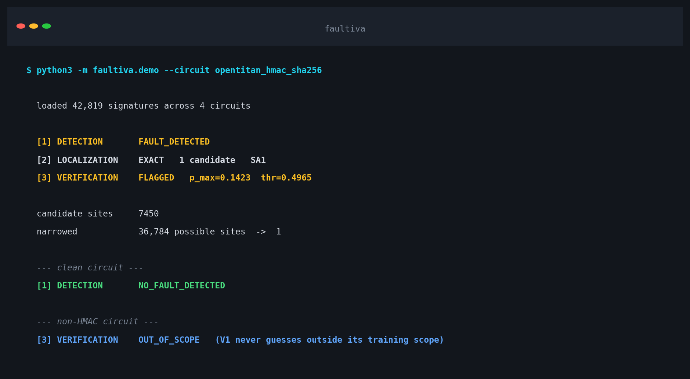
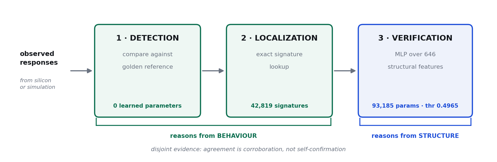

<div align="center">

# Faultiva

### Find the broken gate in a chip from its output alone.

Detection, localization, and structural verification in one 4.7 MB package. No GPU, no network, half a millisecond per query.

<p>
<a href="https://github.com/pavannithin224-abcd/faultiva/actions/workflows/ci.yml"></a>


</p>



</div>

---

## What it does

Give it the responses a circuit produced and the responses it should have produced. It tells
you whether the circuit is faulty, which gates could be responsible, and whether that answer
holds up against an independent structural model.

```python
from faultiva import Faultiva

f = Faultiva()
result = f.analyse("opentitan_hmac_sha256", observed, golden)

print(result.summary())
print(result.candidate_sites)     # the gates that could produce this behaviour
```

On the HMAC circuit that narrows **36,784 possible fault sites to a handful** — often to one.

<div align="center">

</div>

Stages 1 and 2 read **behaviour**, what the circuit actually output. Stage 3 reads
**structure**: the netlist topology around each candidate, with no simulation data at all.
Two independent paths to the same question, so when they agree it means something.

---

## Install

```bash
git clone https://github.com/pavannithin224-abcd/faultiva.git
cd faultiva
pip install -r requirements.txt

sha256sum -c SHA256SUMS      # verify the bundle
python examples/predict_one.py
python examples/end_to_end.py
```

Python 3.10+, numpy, scikit-learn, joblib. Everything needed is in the repository — there is no second download and no model to fetch.

---

## What ships

| circuit | signatures | uniquely localizable | largest candidate set |
|---|---|---|---|
| `secworks_sha256` | 11,654 | 70.7% | 973 |
| `secworks_aes` | 28,189 | 69.3% | 1,519 |
| `opentitan_hmac_sha256` | 2,505 | 42.0% | 26,940 |
| `picorv32_cpu` | 471 | 18.5% | 14,577 |

**127,484** signature-to-site entries in total, built from full stuck-at campaigns across
**7,849,696** transactions with **zero false alarms**.

| | |
|---|---|
| detection | 0.082 ms |
| localization | 0.019–0.046 ms |
| verification (10 candidates) | 0.256 ms |
| **end to end** | **≈0.5 ms** · ~2,000 queries/s on one core |

---

## Four things to know before you rely on it

**1 · Localization returns a set, not always a single gate.**

Faults that produce identical output cannot be told apart by any method that only watches
output. When Faultiva returns six candidates, those six are usually genuinely
indistinguishable. 83–99% of ambiguous sets are structurally equivalent. Treat the set as
the answer, not as a ranked guess.

**2 · Verification covers HMAC only.**

Stage 3's model was trained on `opentitan_hmac_sha256`. On anything else it returns
`OUT_OF_SCOPE` rather than a number it cannot justify. Detection and localization work on all
four shipped circuits.

**3 · Stage 3 disagrees with stage 2 about 29% of the time, by design.**

Across 300 localized HMAC cases, V1 verification returned `VERIFIED` 71% of the time and
`FLAGGED` the rest. That is the point of using disjoint evidence: a behaviourally distinctive
fault at a structurally hard-to-detect site *should* produce disagreement. Read `FLAGGED` as
"the two paths don't corroborate here", not as "localization failed".

**4 · A new circuit needs characterizing before localization works.**

Detection works anywhere you have a golden reference. Localization needs a signature
dictionary, which means a full fault-injection campaign: offline, one time, hours per circuit. For scale: `secworks_chacha`, 10,111 sites and 20,222 faults, took 10.2 minutes on
10 cores. Four circuits ship ready.

<details>
<summary>Scope boundaries and the full evidence trail</summary>

<br>

Faultiva handles **single stuck-at faults** (SA0/SA1). Delay, bridging, transient, and
multi-site faults were never characterized, so results for them are undefined rather than merely uncertain.

The localizer has **zero learned parameters**. That is an evidence-based choice: six learned
formulations were pre-registered and falsified during development, and a non-learning
comparator beat the best of them by roughly 182× on MRR. Within-set localization was then
proven mathematically unidentifiable. The full record, including the failures, is in the
[**V2 study repository**](https://github.com/pavannithin224-abcd/circuitsage-vlsi-fault-detection-v2).

Independent-circuit generalization is **not established**: one of two sealed test circuits
met its pre-registered floor, the other could not be synthesized from its published source.

This is a research artifact. Do not use it as the sole basis for certification or
manufacturing decisions.

</details>

---

## Model card

[**`docs/MODEL_CARD.md`**](docs/MODEL_CARD.md) has the full specification: architecture,
parameter tables, training details, per-circuit evaluation, measured limits, and the audit
hash for every number.

| | |
|---|---|
| total learned parameters | 93,185 (verification only) |
| verification model | MLP 646 → 128 → 64 → 32 → 1, threshold 0.4965 |
| balanced accuracy | 0.8166 · ROC-AUC 0.9166 · Brier 0.1210 |
| localization | exact signature retrieval, 0 parameters |

---

## How it works

Detection hashes the mismatch pattern between observed and golden responses into a
**behaviour signature**. Localization looks that signature up in a dictionary built by
injecting every possible stuck-at fault and recording what each one did — so a match returns exactly the gates capable of producing that behaviour. Verification then scores each
candidate with a model that has never seen simulation output, only netlist structure.

The interesting property is what happens when localization is ambiguous: the candidate set
*is* the fault equivalence class. There is no better answer available from output alone.

---

## Related work

| | |
|---|---|
| [**CircuitSage V2**](https://github.com/pavannithin224-abcd/circuitsage-vlsi-fault-detection-v2) | the study behind this tool: method, pre-registered contracts, audit trail, negative results |
| [**CircuitSage V1**](https://github.com/pavannithin224-abcd/circuitsage-hmac-fault-detection) | the original HMAC detection model, reused here as stage 3 |

---

## Citation

```bibtex
@software{faultiva2026,
  title   = {Faultiva: Hybrid Fault Detection and Localization for VLSI Circuits},
  author  = {Nithin, Pavan},
  year    = {2026},
  version = {1.0.0},
  url     = {https://github.com/pavannithin224-abcd/faultiva}
}
```

## License

Apache-2.0, see [`LICENSE`](LICENSE). Third-party RTL used to build the signature
dictionaries retains its upstream licensing; see the V2 repository for per-project
attribution.

---

<div align="center">
<sub>

Built as an undergraduate major project · [report a defect](https://github.com/pavannithin224-abcd/faultiva/issues) · [contributing](CONTRIBUTING.md)

</sub>
</div>
